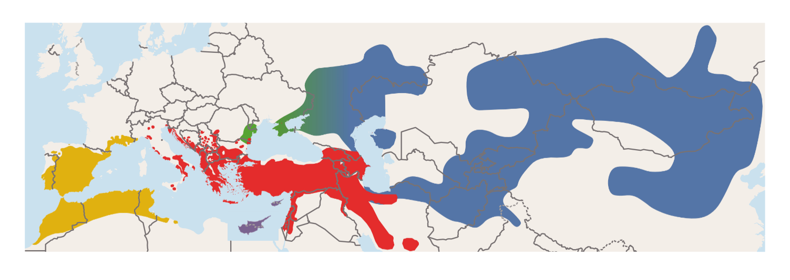
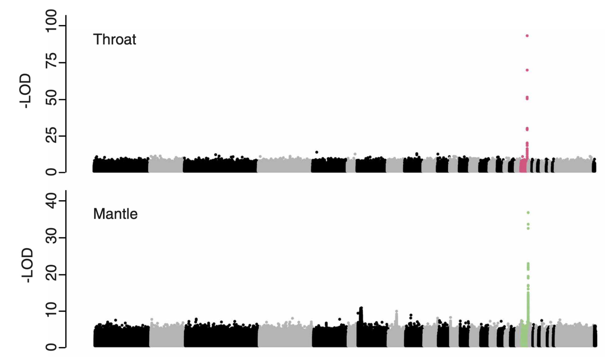

# Population genomics lab 2026-01-20 <!-- omit in toc -->

**Table of contents**
- [Introduction](#introduction)
- [Part 1: Understanding effective population size](#part-1-understanding-effective-population-size)
  - [1.1 Generating the variant data](#11-generating-the-variant-data)
  - [1.2 Calculate proportion of missing data](#12-calculate-proportion-of-missing-data)
  - [1.3 Estimate the SFS for both populations](#13-estimate-the-sfs-for-both-populations)
  - [1.4 Estimate diversity and effective population size](#14-estimate-diversity-and-effective-population-size)
  - [1.5 Different measures of effective population size](#15-different-measures-of-effective-population-size)
- [Part 2: A case study from birds](#part-2-a-case-study-from-birds)
  - [2.1 Analyzing population structure](#21-analyzing-population-structure)
  - [2.2 Estimating differentiation](#22-estimating-differentiation)
  - [2.3 Signatures of hybridization](#23-signatures-of-hybridization)


## Introduction

In this tutorial you will have an introduction to some of the fundamental analyses within population genomics, and gain experience with the interesting evolutionary questions we can address with population genomic data. 

In part 1 of this tutorial, you will work with a simulated dataset to understand how we can estimate that all important parameter, the effective population size ($N_{e}$). 

In part 2, you will work with a real world example, investigating population structure, differentiation, and hybridization in a songbird species complex.

> **NOTE:** Throughout the tutorial you will find code prompts like the one below. I strongly recommend that you attempt to come up with the command line yourself, but these are there to help you if needed.

<details>
    <summary>Code</summary>

    echo "This is here to help you!"

</details>  

## Part 1: Understanding effective population size

In this section of the tutorial, you will generate a simulated dataset of two populations and explore different approaches for estimating the effective population size ($N_{e}$). Everyone will generate an independent dataset, so the exact answers to the questions in this section will vary somewhat from person to person.

Change to the working directory for this exercise, `~/workshop_materials/population_genomics/part1/`

### 1.1 Generating the variant data

Look at the contents of this directory. You will run the script `sim_2pop.py` to generate your variant data. This script runs a backwards-in-time simulation, using the software [msprime](https://tskit.dev/msprime/docs/stable/intro.html#) to generate variant call data for two populations, A and B, based on a user specified demographic history. 


<details>
    <summary>Code</summary>

    python sim_2pop.py

</details>  
  
<br>

Once the script has run, look in the contents of the directory again, and you should now see the file `sim_data_2pop.vcf.gz`

Examine the vcf file to answer the following questions:

- How many individuals are there in each population? *Hint: The population IDs are **A** and **B**.*
- How many variable sites are there in the vcf?


### 1.2 Calculate proportion of missing data 

Before we move on to analyze the data, let's get a sense of the data quality. We will check how much missing data we have at each site, and estimate the average proportion of missing data. 

You might wonder how a simulated dataset contains missing data. This is because I have included a function within the script to include a random percentage of missing data. This can be good practice when using simulated data to evaluate results from real data, as most real data contains missing information.

You can use [vcftools](https://vcftools.github.io/index.html) to calculate the percentage of missing genotypes at each site in the vcf.

<details>
    <summary>Code</summary>

    vcftools --gzvcf sim_data_2pop.vcf.gz --missing-site --out sim_data_2pop_missing_data 

</details>  
  
<br>

This will give you a file with the number of missing genotypes per site. Now estimate the average proportion of missing data for each site. Keep track of this value for later!

<details>
    <summary>Code</summary>

    # This skips the header line and then calculates the average of column 6 (F_MISS)
    
    awk '{if(NR>1) {print}}' sim_data_2pop_missing_data.lmiss | awk '{sum+=$6} END {print sum/NR}' 

</details>  
  

### 1.3 Estimate the SFS for both populations

Now we can compare the SFS for both populations. There is a script provided to output derived allele counts for the two populations.  

<details>
    <summary>Code</summary>

    python get_sim_count_data.py sim_data_2pop.vcf.gz pop_info.txt 

</details>  
  
<br>

Now that you have the derived counts, you can plot the derived SFS. Load the data into R and plot the SFS for population A and B. 

```R
## Load packages
library(ggplot2)

## Load count file
pop_counts <- read.table('pop_allele_counts.txt', header = T, sep = '\t')
head(pop_counts)

## Restructure data for barplot
bar_data <- data.frame('derived_counts' = c(pop_counts$DerivedA, pop_counts$DerivedB), 'popID' = c(rep('A', nrow(pop_counts)), rep('B', nrow(pop_counts))))

## Plot population SFS side by side for A and B
sfs_plot <- ggplot(data=bar_data, aes(x=derived_counts, fill = popID))+
# Plot only from singletons and above
xlim(1,40)+
geom_histogram(position='dodge')

print(sfs_plot)

```

Based on your SFS results, answer the following questions:

- Which class of allele has the most sites?
- Which of the two populations do you think experienced a population expansion? Why?

### 1.4 Estimate diversity and effective population size

Finally, we can estimate and compare nucleotide diversity ($\pi$) for both populations. You can calculate $\pi$ from the allele counts for both populations. To estimate the per site $\pi$, you can use the formula $\Sigma(2*p*q)/L$ where *L* is the total length of the sequence, including invariant sites. In this case, you can use 100000 as L (the length of sequence we simulated). 

<details>
    <summary>Code</summary>

    # This code removes the header and then calculates the allele frequency of the ancestral and derived alleles for population A
    # It then calculates 2*p*q for all sites and takes the sum across all sites divided by the total sequence length

    awk '{if(NR>1) print}' pop_allele_counts.txt | awk '{pA=$1/($1+$2);qA=$2/($1+$2); print 2*pA*qA}' | awk '{sum+=$1} END {print sum/100000}'

    # Run the same for population B

</details>  
<br>


After estimating $\pi$ for both populations, you can calculate the effective population size. 

> *Hint:* recall that $\pi = 4*N_{e}*\mu$. The mutation rate ($\mu$) for this simulated data is $1e-8$

Once you have calculated both $\pi$ and $N_{e}$, open the [google sheet](https://docs.google.com/spreadsheets/d/1KF2iWSUaplGBWBBPu52uN2AzxulBaczeuh5VUkOOKhE/edit?usp=sharing) for this exercise and add your estimates, as well as the average percentage of missing data that you calculated earlier.

Answer the following questions:

- How do your values of $\pi$ and $N_{e}$ for both populations compare?
- Are these values surprising? Why or why not?

Now take a look into the python script that you used to generate your simulated dataset. Because this is simulated data, we have a known value of $N_{e}$ we can compare with our results. Of course with real data we will not have this ground truth.

Open the script and look for the lines that say `demography.add_population()` for both population A and B. 

- What population sizes are specified in our simulation?
- How does this compare with the population sizes you estimated?
- How do you explain any difference that you observe?

### 1.5 Different measures of effective population size

There are many ways to estimate $N_{e}$ that rely upon different types of data or different signals within the data. This can mean that different estimates of $N_{e}$ reflect different timescales in the evolutionary history of a species. For instance, you likely observed that the value of $N_{e}$ you calculated from $\pi$ did not display the more recent change in population size of the two populations that occurred after their split, but more closely matched the longer term, ancestral $N_{e}$. However, in the SFS you observed the impact of a population expansion, which results in an excess of singletons compared to neutral expectations, so there is a signal of this demographic event in our data. Indeed, SFS-based estimates of $N_{e}$ are better suited to estimating changes over the more recent past than $\pi$ is. It's important to understand how different methods of $N_{e}$ vary in the timescales they reflect, to ensure the estimates that you obtain are suited to your evolutionary questions. For more background on this, and further discussion about different approaches to estimate $N_{e}$, I recommend checking out [this review](https://doi.org/10.1111/2041-210X.13740).

One method for estimating $N_{e}$ from the SFS is implemented in the software [Stairwayplot2](https://github.com/xiaoming-liu/stairway-plot-v2). This software takes a bit of time to run, so we will not use it today in the lab, however I have provided plots for you from my own simulated dataset based on the same simulation parameters. Take a look at these plots and answer the following qutestions.

- How does the population size fluctuation compare with your value of $N_{e}$ estimated from $\pi$?
- How does the flucation compare to the true values of $N_{e}$ specified in the simulation?

## Part 2: A case study from birds

For part 2 of the lab, we will move on from our simulated dataset into a real world example. I have provided for you a vcf file containing population sequencing data for a single chromosome from two closely related species of songbird and individuals from a hybrid zone between the two species. These species are *Oenanthe melanoleuca* and *O. pleshcanka*, which are part of the *O. hispanica* species complex. The species have a broad distribution across Eurasia and northern Africa, with hybridization occurring in multiple contact zones. Within the species complex, there is notable variation in plumage coloration both within and between species. Three of the four species are polymorphic for black or white throat coloration, and two species are fixed for black back coloration while two species are fixed for white back coloration.


Within this section of the lab, you will focus on *O. melanoleuca* and *O. pleschanka*, analyzing population structure among these closely related species, examining signatures of genetic differentiation and then investigating signatures of hybridization between them.

Change to the directory for this section, `~/workshop_materials/population_genomics/part2/`

### 2.1 Analyzing population structure

You will analyze population structure among these samples using a principal components analysis, which you can perform with the software [plink](https://www.cog-genomics.org/plink/). 

<details>
    <summary>Code</summary>

    plink --vcf chr20.mel_ple_hyb.vcf.gz --allow-extra-chr --pca --out chr20.mel_ple_hyb 

</details>  
<br>

You can then plot the PCA output in R, and color the points based on the population data encoded in the file `samp_info.txt`

```R
## Load packages
library(ggplot2)

## Load pca data
pca_data <- read.table('chr20.mel_ple_hyb.eigenvec')

## Load pca eigenvals
pca_eigval <- read.table('chr20.mel_ple_hyb.eigenval')

## Load sample data 
samp_data <- read.table('samp_info.txt', header = T)

## Subset pca data for pc1 and pc2
pca_data12 <- pca_data[,c(1,3,4)]

## Add column names
colnames(pca_data12) <- c('samp','PC1','PC2')

## Join pca data with samp data
pca_data12 <- merge(pca_data12, samp_data)

## Calculate % variance explained by PC1 and PC2
pc1_perc <- round((pca_eigval$V1[1]/sum(pca_eigval$V1))*100)
pc2_perc <- round((pca_eigval$V1[2]/sum(pca_eigval$V1))*100)

## Plot PC1 vs PC2, with points colored by population
pc1_2 <- ggplot(data=pca_data12, aes(x = PC1, y = PC2, col=pop))+
geom_point()+
xlab(paste0('PC1 (', pc1_perc, '%)'))+
ylab(paste0('PC2 (', pc2_perc, '%)'))

print(pc1_2)
```

Based on your PCA, answer the following questions:

- How many different groups do you observe in your PCA?
- What are the samples located between *melanolecua* and *pleschanka* in the plot?
- Do the groups defined by the population labels each form a single cluster?
- What might explain the pattern you see in the *pleschanka* samples?

Our genomic analyses in this system actually revealed a cryptic lineage that was previously identified as part of *pleshanka*. We have referred to this as the Pontic lineage, owing to the geographic localization on the Pontic steppe. Look in the directory for the hidden file `.samp_info_pontic.txt` and rename this to make the file visible.

<details>
    <summary>Code</summary>

    mv  .samp_info_pontic.txt samp_info_pontic.txt

</details>  
<br>

Now plot your PCA again, but this time using the sample info in this new file, that separates the *pleschanka* and Pontic lineages.

- How do the population labels perform now at defining different genetic clusters?

We can update the plot of the distribution from the beginning to indicate the location of the Pontic lineage, which highlights that these have a distinct distribution from the rest of the *pleschanka* individuals. Combined with them forming a distinct genetic cluster in the PCA, this also supports distinguishing these samples as a separate lineage.



### 2.2 Estimating differentiation

Before we move to analyze the hybrid individuals, let's analyze our new lineage in a bit more detail. You will estimate chromosome-wide differentiation (*$F_{ST}$*) between all pairs of the three lineages. This can be done using vcftools. We want to know the chromosome-wide average *$F_{ST}$*, but let's also estimate *$F_{ST}$* in genomic windows so that we can look at the variation across the chromosome. Use 200000 basepair non-overlapping windows. **First, you will have to generate sample files for each population, which you can get from the file `samp_info_pontic.txt` using `awk` or `grep`.** 

<details>
    <summary>Code</summary>

    vcftools --gzvcf chr20.mel_ple_hyb.vcf.gz --weir-fst-pop mel_pop.txt --weir-fst-pop ple_pop.txt --fst-window-size 200000 --fst-window-step 200000 --out chr20_fst.mel_ple.w200k.s200k

</details>  
  
<br>

From the output on your terminal you should look at the value `weighted  Fst estimate:` to get the chromosome-wide average. Record this for all three pairwise comparisons of the lineages.

- How does mean differentiation compare for the different lineages?
- Which pairs are the most closely related?
- Does this result reflect what you observe in the PCA?

Now let's look into the variation in *$F_{ST}$* across this chromosome between *melanoleuca* and *pleschanka*. Open the file `chr20_fst.mel_ple.w200k_s200k.windowed.weir.fst` in R and plot *$F_{ST}$* in windows. I have also provided you with estimates of recombination rate along this chromosome, which you can load as well to compare with *$F_{ST}$*.

```R
library(ggplot2)

# Load fst data
fst_mel_ple <- read.table('chr20_fst.mel_ple.w200k_s200k.windowed.weir.fst', header = T)

# Load recombination data 
recom_data <- read.table('chr20.recom_rate.w200k_s200k.txt', header = T)

# Estimate the midpoint of each window
fst_mel_ple$midpt <- (fst_mel_ple$BIN_START + fst_mel_ple$BIN_END)/2
recom_data$midpt <- (recom_data$start+recom_data$stop)/2

# Plot weighted FST along the chromosome
fst_plot_mel_ple <- ggplot(data=fst_mel_ple, aes(x=midpt, y=WEIGHTED_FST))+
geom_point()+
ylim(0,1)

print(fst_plot_mel_ple)

# Plot recombination rate along the chromosome
recom_plot <- ggplot(data=recom_data, aes(x=midpt, y=cm.mb))+
geom_point()

print(recom_plot)
```

- How does variation in *$F_{ST}$* compare with variation in recombination rate?
- Where do you see the largest *$F_{ST}$* values? What do you think these genomic regions might be?

### 2.3 Signatures of hybridization 

Now we will return to the results from the PCA and the hybrids between *melanoleuca* and *pleschanka*. Subsample the PCA results to exclude the pontic individuals. We will then plot PC1 across longitude (our sampling distribution largely moves along a west -> east gradient).

```R
# Subsample pca_data12 to remove pontic
pca_data_subset <- pca_data12[pca_data12$pop!="pon",]

# Plot PC1 along longitude
pc1_long <- ggplot(data=pca_data_subset, aes(x=long, y=PC1))+
geom_point()

print(pc1_long)
```

- What pattern do you observe in your plot?
- What biological processes could underlie this pattern?

The transition between *melanoleuca* and *pleschanka* occurs over a narrow geographic region suggesting either that hybridization is recent, or there are reproductive barriers limiting the spread of gene flow. Natural hybridization can give researchers an opportunity to study how species' boundaries are maintained in the face of gene flow. These can be interesting systems in which to study the process of speciation. In our case, the hybridization of these two species with divergent plumage phenotypes also enabled us to map the genetic basis of this phenotypic trait, since hybridization reshuffles the parental genetic variation. Below, are the results of a GWAS on plumage coloration, identifying a single large effect locus underlying back and throat color variation in *melanolecua* and *pleschanka*. The underlying variants localize in and upstream of the Agouti signalling protein (ASIP), which is found on chromosome 20, that you have been analyzing today.




Identifying the genetic basis of these phenotypic traits allowed us to develop a detailed understanding of the evolutionary history of convergent phenotypic evolution among the broader *Oenanthe hispanica* species complex. I hope that this gives you a taste for some of the questions we can address and analyses we apply within population genomics!


